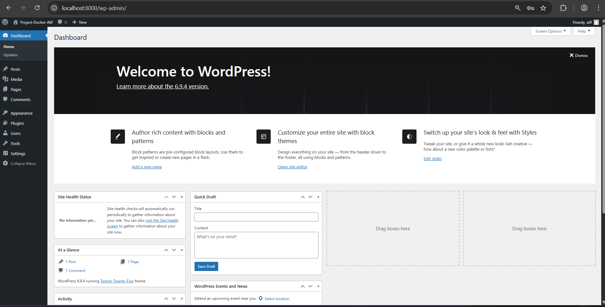

#  WordPress Docker Stack (WordPress + MySQL + Redis)


## Langkah Menjalankan Stack

1. Clone repository:

```bash
git clone <repository-url>
cd wordpress-docker
```

2. Jalankan Docker:

```bash
docker compose up -d
```

3. Cek container:

```bash
docker ps
```

4. Akses WordPress:

```
http://localhost:8000
```

---

## Screenshot

### 1. WordPress Installation Page


### 2. WordPress Dashboard



### 3. Docker Containers Running

Perintah:

```bash
docker ps
```


### 4. Redis CLI Ping Test

Perintah:

```bash
docker exec -it wordpress_redis redis-cli
PING
```

Output:

```
PONG
```


---

## Jawaban Pertanyaan

### 1. Kenapa perlu volume untuk MySQL?

Volume digunakan agar data database tidak hilang ketika container dihentikan atau dihapus. Tanpa volume, semua data akan hilang saat container restart.

---

### 2. Apa fungsi depends_on?

depends_on digunakan untuk mengatur urutan startup container. Dalam project ini, WordPress akan menunggu MySQL dan Redis berjalan terlebih dahulu sebelum start.

---

### 3. Bagaimana cara WordPress container connect ke MySQL?

WordPress terhubung ke MySQL melalui network Docker dengan menggunakan nama service sebagai hostname, yaitu:

```
DB_HOST = mysql
```

Docker otomatis menyediakan DNS internal sehingga container bisa saling berkomunikasi.

---

### 4. Apa keuntungan pakai Redis untuk WordPress?

* Mempercepat loading website
* Mengurangi query ke database MySQL
* Meningkatkan performa dan scalability
* Menyimpan cache object sehingga akses data lebih cepat

---
